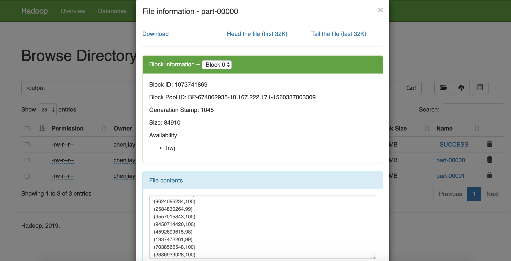

# Lab 3

### Simple Drill queries

#### 1. Connecting to drill


#### 2. Read csv

```sql
-- read csv as table
SELECT COLUMNS[1] AS user_id,
COLUMNS[0] AS username, COLUMNS[2] AS grade
FROM (select * from hdfs.`gradebook\.csv`);

-- select min grade
SELECT username, MIN(grade) FROM (SELECT COLUMNS[1] AS user_id,
COLUMNS[0] AS username, COLUMNS[2] AS grade
FROM (select * from hdfs.`gradebook\.csv`)) GROUP BY username;

-- select max average grade
SELECT MAX(avg_grade) FROM (
  SELECT avg(grade) as avg_grade FROM (
    SELECT COLUMNS[1] AS user_id, CAST(COLUMNS[2] AS INT) AS grade FROM (
      select * from hdfs.`gradebook\.csv`)
 	 	) GROUP BY user_id
);

-- get median
SELECT ol.user_name, ol.grade FROM (
  select user_name, grade, (select count(*)/2 from hdfs.`gradebook\.csv`) as ct, row_number() over (order by grade) AS num FROM (
  SELECT COLUMNS[0] AS user_name, CAST(COLUMNS[2] AS INT) AS grade FROM (
      select * from hdfs.`gradebook\.csv`)
  )
) as ol WHERE ( ol.num>ol.ct-1 and ol.num<ol.ct+1);
```


#### 3. Result (selected parts)


### Simple Spark

#### 1. build cluster


#### 2. Code

```scala
val distFile=sc.textFile("hdfs://cjy:9000/gradebook.csv")
var lines=distFile.map(line=>(line.split(",")(1),Integer.parseInt(line.split(",")(2))))
val result=lines.reduceByKey((a,b)=>Math.max(a,b))
result.saveAsTextFile("hdfs://cjy:9000/output")
```


#### 3. Result




#### 4. Time comparison

| size     | single node time | multinodes (3) time | Spark time(s) |
| -------- | ---------------- | ------------------- | ------------- |
| 10000    | 8.67             | 8.94                | 1.67          |
| 100000   | 9.77             | 10.3                | 1.89          |
| 500000   | 12.7             | 12.96               | 2.37          |
| 1000000  | 16.02            | 15.87               | 2.89          |
| 10000000 | 86.16            | 79.55               | 14.42         |